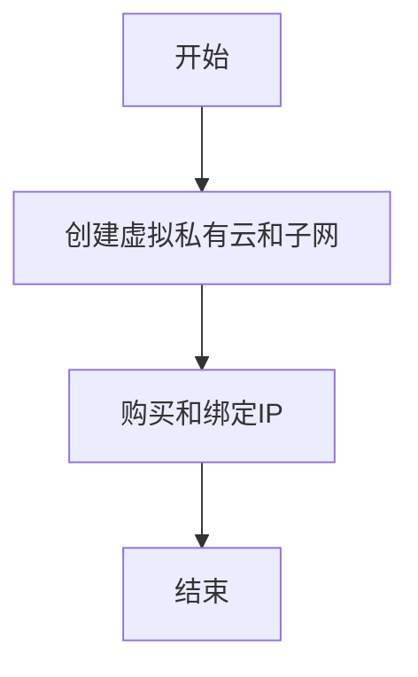
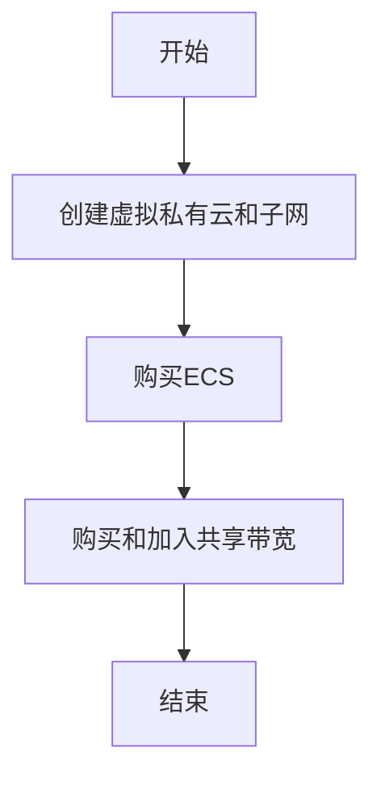

<h1 align="center">VPC</h1>

## 什么是VPC？

虚拟私有云：基于安全的隧道网络技术，为您提供安全、隔离的网络环境。

「VPC」可以自定义，包括「**划分子网**、**配置路由表**、**指定IP地址**等」，同时还支持配置网络安全策略，安全组对「ECS」进行防护。使用网络ACL对子网进行防护，全方位保护网络的安全。

云厂商一般提供了「**弹性公网IP[*EIP*]**、**弹性负载均衡[*ELB*]**、**NAT网关[*NAT GW*]**、**虚拟专用网络[*VPN*]**、**云专线[*DC*]**等」

## 搭建IPV4网络

### 图示

### 步骤

#### 创建虚拟私有云和子网

1. 登录管理控制台。
2. 在管理控制台左上角单击<image src="images/0.png">，选择区域和项目。
3. 选择“网络 > 虚拟私有云”。
4. 单击“创建虚拟私有云”。
5. 根据界面提示配置「虚拟私有云 (vpc-text)」和「子网 (subnet-01)」参数。
6. 立即创建

##### 参数注释

###### 表1 虚拟私有云参数说明

| 参数     | 说明                                                         | 取值样例               |
| -------- | ------------------------------------------------------------ | ---------------------- |
| 区域     | 不同区域的资源之间内网不互通。请选择靠近您客户的区域，可以降低网络时延、提高访问速度。 | 华北-北京一            |
| 名称     | VPC名称。                                                    | vpc-test               |
| 网段     | VPC的地址范围，VPC内的子网地址必须在VPC的地址范围内。目前支持网段范围：10.0.0.0/8~24172.16.0.0/12~24192.168.0.0/16~24 | 192.168.0.0/16         |
| 企业项目 | 创建VPC时，可以将VPC加入已启用的企业项目。企业项目管理提供了一种按企业项目管理云资源的方式，帮助您实现以企业项目为基本单元的资源及人员的统一管理，默认项目为default。 | default                |
| 标签     | 虚拟私有云的标识，包括键和值。可以为虚拟私有云创建10个标签。标签的命名规则请参见[表3](https://support.huaweicloud.com/qs-vpc/zh-cn_topic_0017816228.html#zh-cn_topic_0017816228__table63360804153019)。 | 键：vpc_key1值：vpc-01 |

###### 表2 子网参数说明

| 参数          | 说明                                                         | 取值样例                     |
| ------------- | ------------------------------------------------------------ | ---------------------------- |
| 可用区        | 可用区是指在同一地域内，电力和网络互相独立的物理区域。在同一VPC网络内可用区与可用区之间内网互通，可用区之间能做到物理隔离。 | 可用区3                      |
| 名称          | 子网的名称。                                                 | subnet-01                    |
| 子网网段      | 子网的地址范围，需要在VPC的地址范围内。                      | 192.168.0.0/24               |
| 关联路由表    | 子网创建完成后默认关联默认路由表，您也可以通过子网的更换路由表操作，切换至自定义路由表。 | 默认                         |
| 高级配置      | 单击下拉箭头，可配置子网的高级参数，包括网关、DNS服务器地址等。 | 默认配置                     |
| 网关          | 子网的网关。                                                 | 192.168.0.1                  |
| DNS服务器地址 | 默认配置了2个DNS服务器地址（包括两个内网DNS地址或一个内网和一个公网DNS地址，且内网DNS地址优先于公网DNS地址），便于使VPC内服务通过内网DNS访问云上服务，不经公网，降低时延。若您想要使用其他公网DNS进行解析，可以修改默认的DNS服务器地址。 | 100.125.x.x                  |
| DHCP租约时间  | DHCP租约时间是指DHCP服务器自动分配给客户端的IP地址的使用期限。超过租约时间，IP地址将被收回，需要重新分配。单位：天或者小时。DHCP租约时间改后，会在一段时间后自动生效（与您的DHCP租约时长有关），如果需要立即生效，请重启ECS或者在实例中主动触发DHCP更新。更多信息请参见[修改子网的dhcp租约时间后如何立即生效？](https://support.huaweicloud.com/vpc_faq/zh-cn_topic_0177255344.html) | 365                          |
| 标签          | 子网的标识，包括键和值。可以为子网创建10个标签。标签的命名规则请参见[表4](https://support.huaweicloud.com/qs-vpc/zh-cn_topic_0017816228.html#zh-cn_topic_0017816228__table4168255153519)。 | 键：subnet_key1值：subnet-01 |

###### 表3 虚拟私有云标签命名规则

| 参数 | 规则                                                         | 样例     |
| ---- | ------------------------------------------------------------ | -------- |
| 键   | 不能为空。对于同一虚拟私有云键值唯一。长度不超过36个字符。由英文字母、数字、下划线、中划线、中文字符组成。 | vpc_key1 |
| 值   | 长度不超过43个字符。由英文字母、数字、下划线、点、中划线、中文字符组成。 | vpc-01   |

###### 表4 子网标签命名规则

| 参数 | 规则                                                         | 样例        |
| ---- | ------------------------------------------------------------ | ----------- |
| 键   | 不能为空。对于同一子网键值唯一。长度不超过36个字符。由英文字母、数字、下划线、中划线、中文字符组成。 | subnet_key1 |
| 值   | 长度不超过43个字符。由英文字母、数字、下划线、点、中划线、中文字符组成。 | subnet-01   |

### 购买ECS

在管理控制台，选择“计算 > 弹性云服务器”，购买一个ECS实例。

#### 网络配置请按如下设置

- 网络：选择已创建的「虚拟私有云 (vpc-text)」和「子网 (subnet-01)」
- 安全组：选择默认安全组。
- 弹性公网IP：选择“暂不购买”。

##### 默认安全组配置

| 方向   | 协议 | 端口范围 | 目的地址/源地址                         | 说明                                                         |
| ------ | ---- | -------- | --------------------------------------- | ------------------------------------------------------------ |
| 出方向 | 全部 | 全部     | 目的地址：0.0.0.0/0                     | 允许所有出站流量的数据报文通过。                             |
| 入方向 | 全部 | 全部     | 源地址：当前安全组ID (例如：sg-*xxxxx*) | 仅允许安全组内的弹性云服务器彼此通信，丢弃其他入站流量的全部数据报文。 |
| 入方向 | TCP  | 22       | 源地址：0.0.0.0/0                       | 允许所有IP地址通过SSH远程连接到Linux弹性云服务器。           |
| 入方向 | TCP  | 3389     | 源地址：0.0.0.0/0                       | 允许所有IP地址通过RDP远程连接到Windows弹性云服务器。         |

### 步骤3：购买和绑定EIP

1. 登录管理控制台。
2. 在管理控制台左上角单击<image src="images/0.png">，选择区域和项目。
3. 在系统首页，选择“网络 > 虚拟私有云”。
4. 选择“弹性公网IP和带宽 > 弹性公网IP”。
5. 单击“购买弹性公网IP”。
6. 根据界面提示配置参数。
7. 单击“立即购买”。

#### 绑定EIP

1. 在“弹性公网IP”界面，单击“绑定”。
2. 选择ECS。

## 搭建IPV6网络

### 图示

### 步骤

#### 创建虚拟私有云和子网

1. 登录管理控制台。

2. 在管理控制台左上角单击<image src="images/0.png">，选择区域和项目。

3. 选择“网络 > 虚拟私有云”。

4. 单击“创建虚拟私有云”。

5. 根据界面提示配置虚拟私有云和子网参数。

   子网配置时，请务必勾选“开启IPv6”，将自动为子网分配IPv6网段。该功能一旦开启，将不能关闭。暂不支持自定义设置IPv6网段。

6. 单击“立即创建”。

### 购买ECS

1. 在管理控制台，选择“计算 > 弹性云服务器”，购买一个ECS实例。

网络配置请按如下设置：

- 网络：
  - 虚拟私有云：选择已创建的“vpc-ipv6”。
  - 子网：选择已创建的“subnet-ipv6”。
  - 务必选择“自动分配IPv6地址”。
  - 共享带宽
    - 当选择“暂不配置”，则仅支持VPC内的IPv6相互通信。
    - 当此时新建共享带宽或选择已有共享带宽，则配置完成后IPv6 地址直接开启公网访问功能。
- 安全组：选择默认安全组“Sys-default”。默认安全组的规则是在出方向上的IPv4/IPv6数据报文全部放行，入方向访问受限，安全组内的弹性云服务器无需添加规则即可互相访问。
- 弹性公网IP：选择“暂不购买”。

购买完成后，您可以在ECS详情页查看自动分配的IPv6地址，也可以登录到ECS，通过**ifconfig**查看分配的IPv6地址。

### 购买和加入共享带宽

#### 购买共享带宽

1. 登录管理控制台。
2. 在管理控制台左上角单击<image src="images/0.png">，选择区域和项目。
3. 在系统首页，选择“网络 > 虚拟私有云”。
4. 在左侧导航栏，选择“弹性公网IP和带宽 > 共享带宽”。
5. 在页面右上角，单击“购买共享带宽”，按照提示配置参数。
6. 单击“立即购买”。

#### 加入共享带宽

1. 在共享带宽列表页，单击操作列的“添加公网IP”。
2. 将IPv6地址加入共享带宽。
3. 单击“确定”。

## 网络规划

### 如何规划VPC的数量？

- VPC具有区域属性，默认情况下，不同区域的VPC之间内网不互通，同区域的不同VPC内网不互通，同一个VPC下的不同可用区之间内网互通。
- 一个VPC
  - 当各业务之间没有网络隔离需求时，您可以只使用一个VPC即可。
- 多个VPC
  - 当您在当前区域下有多套业务部署，且希望不同业务之间进行网络隔离时，则可为每个业务在当前区域建立相应的VPC。两个VPC之间可以采用对等连接进行互连。参考图一

*图1 对等连接*

<image src="images/1.png">

- Tips:
  - 默认情况下一个用户支持创建5个VPC，如果配额不满足实际需求，可以申请扩容。	

### 如何规划子网？

子网是VPC内的IP地址块，VPC中的所有云资源都必须部署在子网内。同一个VPC下，子网网段不可重复。子网创建成功后，网段无法修改。

VPC支持的网段如下，子网的网段须在VPC网段范围内，且子网的掩码范围为：子网所在VPC掩码~29。

- 10.0.0.0/8~24
- 172.16.0.0/12~24
- 192.168.0.0/16~24

