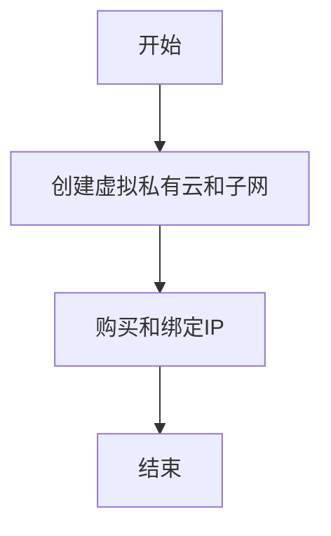

<h1 align="center">VPC</h1>

## 什么是VPC？

虚拟私有云：基于安全的隧道网络技术，为您提供安全、隔离的网络环境。

「VPC」可以自定义，包括「**划分子网**、**配置路由表**、**指定IP地址**等」，同时还支持配置网络安全策略，安全组对「ECS」进行防护。使用网络ACL对子网进行防护，全方位保护网络的安全。

云厂商一般提供了「**弹性公网IP[*EIP*]**、**弹性负载均衡[*ELB*]**、**NAT网关[*NAT GW*]**、**虚拟专用网络[*VPN*]**、**云专线[*DC*]**等」

## 搭建IPV4网络

### 图示

### 步骤

#### 创建虚拟私有云和子网

1. 登录管理控制台。
2. 在管理控制台左上角单击，选择区域和项目。
3. 选择“网络 > 虚拟私有云”。
4. 单击“创建虚拟私有云”。
5. 根据界面提示配置虚拟私有云和子网参数。

